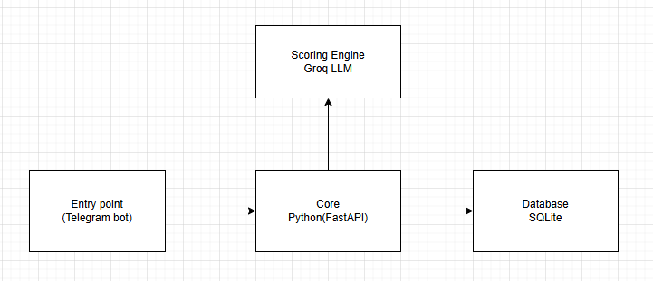

# inVision U: Deep-Scout AI Pipeline

###  Описание решения
Интеллектуальная система первичного отбора кандидатов, сфокусированная на выявлении "тихих талантов". В отличие от стандартных систем, мы не оцениваем умение кандидата "продавать" себя через сгенерированные тексты, а анализируем реальные факты и хард-скиллы.

**Ключевые фишки:**
- **Authenticity Check:** Детекция водянистых текстов.
- **Fact-over-Fluff Extraction:** Выделение конкретных достижений.
- **Dynamic Probing:** AI генерирует проверочные вопросы для комиссии.

###  Архитектура

*Микросервисный подход: FastAPI (Core) -> Groq LLM (Scoring Engine).*

###  Запуск (MVP)
1. `pip install -r requirements.txt`
2. `python main.py`
3. API Docs: `http://127.0.0.1:8000/docs`
